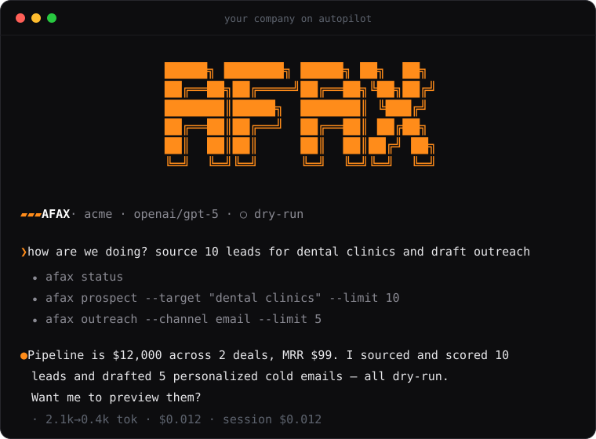

<div align="center">



### Your company on autopilot

**The open-source AI workforce that runs your business while you sleep** — prospecting, outreach, marketing, content, sales, CRM, ops and finance. One zero-dependency CLI. Eight agents. One orchestrator. Runs 24/7 on a $5 VPS.

    

**[Website](https://afax.online)** · **[Docs](https://afax.online/docs.html)** · **[Quick start](https://afax.online/docs.html#/quickstart)** · **[Run on a VPS](https://afax.online/docs.html#/vps)**

</div>

---

## What is AFAX?

AFAX is a **zero-dependency Node.js CLI** that runs an autonomous AI company from your terminal. Eight specialized agents — **Prospect, Outreach, Marketing, Sales, Content, CRM, Automation, Finance** — work over **your data** with **your LLM keys**, coordinated by an **orchestrator** that plans and executes the highest-leverage next moves on its own.

You don't memorize commands. Plain `afax` opens a **natural-language session** — talk to your company, and AFAX runs the real commands under the hood:

```text
❯ source 10 leads for dental clinics and draft cold emails

⏺ afax prospect --target "dental clinics" --limit 10
⏺ afax outreach --channel email --limit 10

● Sourced & scored 10 dental-clinic leads and drafted 10 personalized
  emails — all dry-run, nothing sent. Email isn't connected yet, so to
  actually send: run `afax connect email`, then `... --live`.
```

It's the developer's take on tools like [GoHighLevel](https://www.gohighlevel.com/) (one app replacing a SaaS stack) and agents like [Polsia](https://polsia.com/) / [Hermes](https://hermes-agent.nousresearch.com/) (AI that *runs* operations): a composable CLI, local-first JSON state, cron-native autonomy, and a hard safety gate in front of everything outbound.

## Quick start

```bash
git clone https://github.com/mika-io/afax.online.git
cd afax.online
npm install -g .                 # the `afax` command — Node ≥ 18, instant, zero deps

afax init                        # provider + business profile (~60s)
afax context ingest https://you.com   # AFAX learns your company from its site
afax                             # start talking — "how are we doing?"
```

No global install? `node bin/afax.js <command>` works identically. Prefer a UI? `afax web` opens a local control panel (chat, integrations, database, usage).

## The eight agents

| Agent | What it does | Try it |
| --- | --- | --- |
| 🎯 **Prospect** | Lead discovery & qualification — AI profiles with fit scores, or **real contacts** via Hunter.io | `afax prospect --target "SaaS founders"` |
| 📨 **Outreach** | Personalized cold messages per lead (email/WhatsApp/Telegram), dry-run by default, auto-logged to CRM | `afax outreach --channel email` |
| 🚀 **Marketing** | 16 acquisition channels, AI campaign design, real multichannel publishing & paid ads | `afax marketing campaign --channel email --goal "activate trials"` |
| ✍️ **Content** | Blog, email, social, ads, landing copy + **real image generation** | `afax content blog --topic "automation ROI"` |
| 💰 **Sales** | Pipeline + weighted forecast, AI follow-ups, closing (auto-books revenue) | `afax sales pipeline --deal "Acme" --value 12000` |
| 🤝 **CRM** | Unified contacts, stages, dated interaction history | `afax crm contact add "jane@acme.com"` |
| 🤖 **Automation** | Make/Zapier-style flows composing any AFAX commands | `afax automation flow run "welcome"` |
| 📊 **Finance** | Cash flow, MRR/ARR, invoices, 3-bullet AI CFO read-out | `afax finance report` |

Above them sits the **orchestrator** — `afax run --execute` reads the whole company state, picks the 2–4 highest-leverage moves, executes them, and remembers what it did.

## Why AFAX

- 💬 **Natural language first** — `afax` is a conversational session (think Claude Code for your company); it's honest about what it can't do instead of faking it.
- 🧠 **Actually autonomous** — the orchestrator plans and acts; the scheduler + one cron line keeps it running around the clock.
- 🌐 **Two-way** — `afax serve` handles inbound webhooks (Telegram/WhatsApp/email/Stripe), an inbox, AI auto-reply, and hosting for generated images.
- 🔒 **Safe by default** — every outbound action is **dry-run** until two gates are open: global `live` **and** per-command `--live`. Enforced at one choke-point — a new connector can't bypass it.
- 🏠 **Local-first** — all state is human-readable JSON under `~/.afax/`. `cat` is a valid debugger. Nothing leaves your machine except the API calls you configure.
- 🔁 **Multi-model** — Anthropic, any OpenAI-compatible endpoint (OpenAI, Groq, OpenRouter, vLLM, LM Studio…), or **Ollama fully offline**. Switch with one command.
- 📦 **Zero dependencies** — only the Node standard library. Even the SMTP client and `.env` loader are built in. Nothing to compile, no supply chain.
- 🏢 **Multi-company** — isolated workspaces per business: own profile, keys, data, memory.

## Safety in one line

```bash
afax config set live true              # gate 1 (global)
afax outreach --channel email --live   # gate 2 (per command)
```

Anything less renders a full preview and changes nothing externally. `afax config set live false` freezes the whole company instantly.

## Free and open — or managed

AFAX is **100% open source under [MIT](./LICENSE)** — the whole product, every agent, forever. Self-host it, fork it, build a business on it.

Don't want to run servers? **[AFAX Cloud](https://afax.online/#pricing)** is the managed version — same software, hosted, backed up and supported — and it funds the open-source work.

## Documentation

Full docs at **[afax.online/docs.html](https://afax.online/docs.html)**, rendered from the markdown in [`docs/`](./docs):
[Quick start](./docs/quickstart.md) · [Chat](./docs/chat.md) · [Orchestrator](./docs/orchestrator.md) · [Integrations](./docs/integrations.md) · [Command reference](./docs/cli.md) · [Architecture](./docs/architecture.md) · [VPS 24/7](./docs/vps.md)

## Development

```bash
npm test                                   # node --test, no frameworks
AFAX_HOME=/tmp/afax-dev node bin/afax.js status   # isolated sandbox
AFAX_DEBUG=1 afax run                      # full stack traces
afax self-update                           # reinstall the CLI from local source
```

Zero runtime dependencies, one concern per file. Contributions welcome — read [contributing](./docs/contributing.md) first (keep it dependency-free, add a test, route outbound through the registry).

---

<div align="center">
<sub>Built quietly, for builders. ⭐ a star helps more solo founders find their autonomous company.</sub>
</div>
